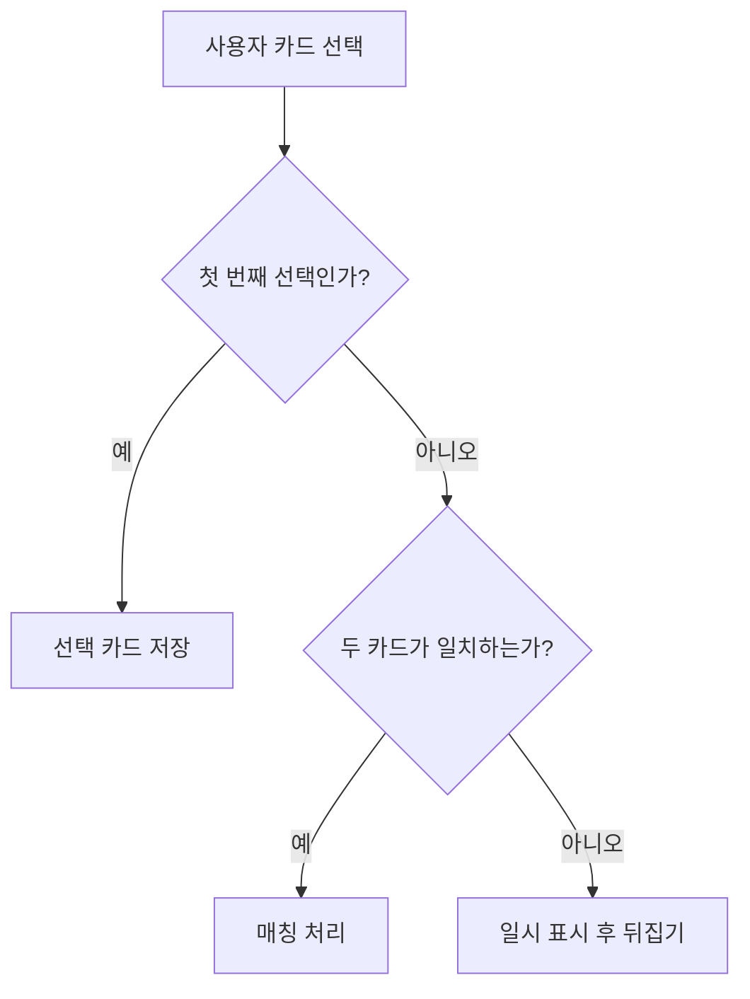

# GitHub Copilot Instructions

## 기본 원칙

- 모든 응답, 설명, 리뷰, 댓글은 기본적으로 한글로 작성한다.
- 사용자가 명시적으로 다른 언어를 요청한 경우에만 해당 언어를 사용한다.
- 추측으로 단정하지 말고, 코드와 문서에서 확인한 사실을 기준으로 답한다.
- 변경은 요청 범위 안에서 최소한으로 수행하고, 불필요한 리팩터링이나 스타일 변경은 피한다.
- 기존 TypeScript, React, Vite, Apps in Toss WebView/Granite 스타일과 파일 구조를 우선 따른다.
- 외부 참조 저장소와 문서는 읽기 전용 참고 자료로 다룬다. 명시 요청 없이 수정하지 않는다.

## 프로젝트 맥락

이 프로젝트는 기존 Unity 게임을 Apps in Toss WebView/Granite 기반 앱으로 포팅하는 프로젝트다.

작업 전 다음 자료를 우선 참고한다.

- 원본 Unity 프로젝트: `/Users/syous/Repositories/seoleeapps/MatchPictureUnity`
- 설계 및 기획 문서: `/Users/syous/Obsidian/Vault/30 Projects/Active/같은그림찾기`
- Apps in Toss 문서 인덱스: `.cursor/skills/apps-in-toss.md`

구현 판단 기준:

- 게임 동작, 애셋 구조, 밸런스, 연출은 원본 Unity 프로젝트의 실제 구현을 먼저 확인한다.
- 요구사항이나 우선순위가 불명확하면 설계 및 기획 문서를 먼저 확인한다.
- Apps in Toss API, 심사 정책, WebView/Granite 제약이 관련되면 `.cursor/skills/apps-in-toss.md`와 공식 문서를 함께 확인한다.
- 원본 Unity 프로젝트와 Obsidian 문서는 참고 자료이며, 이 저장소의 구현 방식에 맞게 작게 옮긴다.

## 코드 작성 지침

- React 컴포넌트는 기존 컴포넌트 구조와 CSS 패턴을 따른다.
- 게임 규칙, 덱 생성, 상태 전이, 점수 계산처럼 동작 안정성이 중요한 코드는 테스트를 함께 고려한다.
- Apps in Toss 연동 코드는 실제 WebView 환경과 로컬 개발 환경의 차이를 고려해 방어적으로 작성한다.
- 사용자 경험에 영향을 주는 변경은 모바일 WebView 기준으로 레이아웃, 터치 영역, 가독성, 성능을 함께 검토한다.
- 타입은 명시적으로 좁히고, `any`는 불가피한 경계 코드에서만 사용한다.
- 비동기 처리는 실패, 취소, 중복 호출, 재시도 가능성을 고려한다.
- 저장소, 광고, 랭킹, 리뷰, 네비게이션 등 플랫폼 API 주변 코드는 기능 경계를 명확히 유지한다.
- 매직 넘버나 복잡한 조건은 의미가 드러나도록 이름을 부여하되, 과한 추상화는 피한다.
- 코드 주석은 의도가 코드만으로 충분히 드러나지 않는 경우에만 짧게 작성한다.

## 테스트 및 검증

- 변경한 영역에 맞는 가장 작은 검증부터 수행한다.
- 게임 로직, 세션 설정, Apps in Toss 래퍼처럼 회귀 위험이 있는 영역은 Vitest 테스트를 우선 고려한다.
- UI 변경은 모바일 폭과 데스크톱 폭에서 텍스트 겹침, 클릭 가능 영역, 스크롤 동작을 확인한다.
- 검증을 수행하지 못한 경우에는 그 이유와 남은 위험을 명확히 설명한다.
- 가능한 명령:
  - `npm test`
  - `npm run lint`
  - `npm run build`

## 리뷰 기본 지침

PR 리뷰는 버그, 회귀, 보안, 데이터 손실, 사용자 영향, 테스트 누락을 우선으로 본다.

리뷰 댓글은 가능한 한 다음 구조를 따른다.

- 문제의 영향
- 문제가 발생하는 조건
- 근거가 되는 파일, 함수, 흐름
- 권장 수정 방향
- 필요한 경우 재현 방법 또는 테스트 제안

리뷰의 우선순위는 다음 단계로 구분한다.

- `심각`: 배포 차단 수준의 버그, 데이터 손실, 앱 진입 불가, 핵심 게임 진행 불가, 보안/정책 위반 가능성
- `경고`: 특정 조건에서 사용자 경험 또는 기능이 깨지는 문제, 회귀 위험, 테스트 누락으로 인한 실질적 불확실성
- `참고`: 유지보수성, 가독성, 사소한 성능 개선, 일관성 개선 등 배포 차단은 아니지만 고치면 좋은 사항

PR 리뷰 본문은 심각도가 높은 항목부터 정렬한다. 가능하면 다음 형식을 사용한다.

```md
## 리뷰 결과

### 심각

- [파일:라인] 핵심 문제 요약
  - 영향:
  - 근거:
  - 제안:

### 경고

- [파일:라인] 핵심 문제 요약
  - 영향:
  - 근거:
  - 제안:

### 참고

- [파일:라인] 핵심 문제 요약
  - 영향:
  - 근거:
  - 제안:
```

문제가 없으면 억지로 지적하지 말고, 확인한 범위와 남은 테스트 공백을 짧게 남긴다.

## Mermaid 다이어그램 활용

리뷰, 댓글, 설명에서 흐름이나 상태 전이가 관련되면 가능한 한 Mermaid 다이어그램을 사용한다.

특히 다음 상황에서는 Mermaid 사용을 우선 고려한다.

- 게임 상태 전이
- 카드 선택 및 매칭 흐름
- Apps in Toss API 호출 흐름
- 광고, 랭킹, 리뷰, 저장소 연동 흐름
- 비동기 처리와 실패 경로
- PR 변경 전후 구조 비교

예시:



다이어그램은 이해를 돕는 수단으로 사용한다. 단순한 한 줄 지적에 억지로 추가하지 않는다.

## 답변 스타일

- 결론을 먼저 말하고, 필요한 근거를 뒤에 붙인다.
- 장황한 배경 설명보다 사용자가 바로 적용할 수 있는 조치를 우선한다.
- 파일명, 함수명, 명령어는 백틱으로 감싼다.
- 불확실한 부분은 불확실하다고 표시하고 확인 방법을 제시한다.
- 변경 제안은 이 저장소에서 실제로 적용 가능한 형태로 작성한다.

